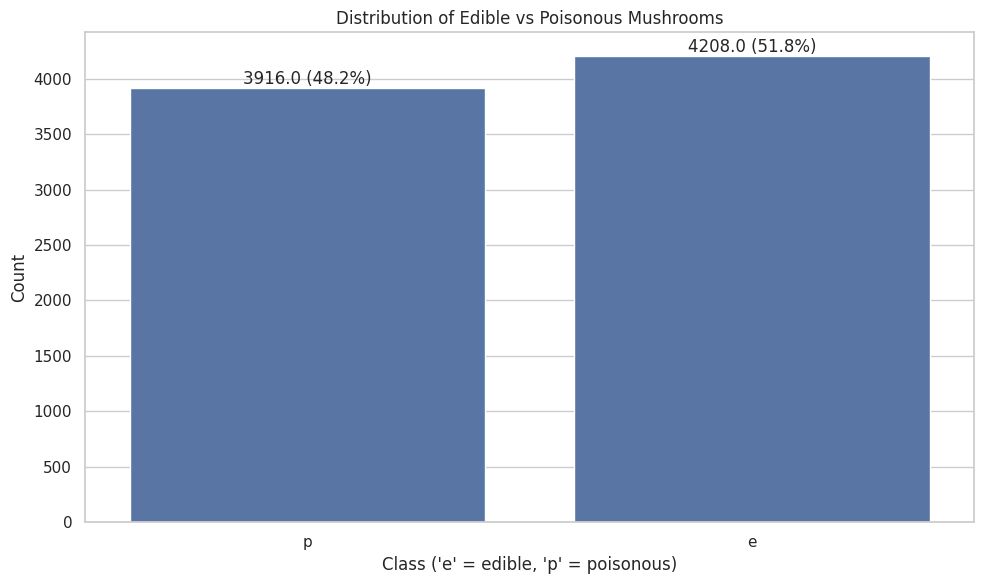

# Proyek Machine Learning - Klasifikasi Jamur

## Domain Proyek

Mengenali jamur yang aman dimakan dan yang beracun memang bukan hal mudah, tapi topik ini menarik perhatian saya. Bayangkan, saat kalian jalan-jalan di hutan dan menemukan jamur yang terlihat menggoda, tapi ternyata bisa membahayakan kesehatan, pengalaman ini pasti akrab bagi para pengumpul jamur. Salah pilih bisa berakibat serius, mulai dari keracunan hingga hal yang lebih buruk. Makanya, saya penasaran bagaimana cara membedakan jamur dengan lebih akurat.

Dari buku [Audubon Society Field Guide](https://www.audubon.org/marketplace/field-guides), saya belajar bahwa tidak ada cara singkat untuk tahu apakah jamur itu beracun atau tidak. Kalau tanaman seperti Poison Oak punya ciri khas "daun tiga, harus di hindari," jamur jauh lebih rumit. Kita harus perhatikan detail seperti warna tutupnya, bentuk batangnya, atau bahkan baunya. Tapi, jujur saja, untuk orang awam seperti saya, mengingat semua detail ini tidaklah mudah.

Di sinilah machine learning jadi solusi menarik. Idenya sederhana kita beri komputer data tentang karakteristik fisik jamur seperti tekstur, ukuran, atau pola warnanya, lalu latih model untuk memprediksi apakah jamur itu aman atau beracun. Menarik, bukan? Dengan cara ini, kita bisa punya alat yang membantu mencegah kesalahan identifikasi, baik untuk keamanan pangan maupun penelitian mikologi.

## Business Understanding

Dalam proyek ini, fokus saya adalah membangun model klasifikasi yang bisa membedakan jamur beracun dan yang dapat dimakan dengan akurasi tinggi(ekpetasi :]). Solusi ini tidak hanya bermanfaat untuk orang-orang yang suka mengumpulkan jamur, tapi juga punya nilai besar untuk keamanan pangan, penelitian mikologi, dan bahkan industri makanan.

### Problem Statements

Berdasarkan latar belakang di atas, rumusan masalah dalam proyek ini adalah

- Apa saja karakteristik fisik utama yang membedakan jamur beracun dan yang dapat dimakan?
- Bagaimana cara membangun model machine learning yang bisa mengklasifikasikan jamur dengan akurasi tinggi berdasarkan karakteristik fisiknya?  
- Algoritma klasifikasi mana yang memberikan performa terbaik untuk dataset jamur ini?
- Bagaimana model dapat memberikan wawasan praktis untuk membantu identifikasi jamur?

### Goals

Tujuan proyek ini adalah

- Mengidentifikasi karakteristik fisik yang paling berpengaruh terhadap toksisitas jamur melalui analisis data.  
- Membangun model klasifikasi dengan akurasi minimal 95%.  
- Mengevaluasi dan membandingkan performa algoritma K-Nearest Neighbors dan Random Forest untuk menemukan yang terbaik.  
- Menghasilkan wawasan praktis untuk membantu identifikasi jamur di dunia nyata.

### Solution Statements

Untuk mencapai tujuan ini, saya akan melakukan

- Mengembangkan dua model klasifikasi:  
  - K-Nearest Neighbors (KNN): Algoritma sederhana yang mengklasifikasikan berdasarkan kemiripan dengan data terdekat. Cocok untuk data kategorikal seperti dataset ini.  
  - Random Forest: Algoritma yang menggunakan banyak pohon keputusan untuk prediksi lebih akurat dan stabil, sekaligus menunjukkan karakteristik mana yang paling penting.
- Melakukan feature engineering dan preprocessing yang tepat
  - Menangani missing values dengan metode yang sesuai untuk data kategorikal.  
  - Mengubah data kategorikal menjadi numerik (encoding).  
  - Menganalisis kontribusi setiap karakteristik terhadap klasifikasi.
- Menggunakan metrik evaluasi seperti akurasi, presisi, recall, dan F1-score, dengan fokus pada recall untuk meminimalkan kesalahan mengklasifikasikan jamur beracun sebagai aman.

## Data Understanding

Dataset yang digunakan dalam proyek ini adalah Mushroom Dataset dari UCI Machine Learning Repository. Dataset ini berisi deskripsi sampel hipotetis dari 23 spesies jamur dalam keluarga Agaricus dan Lepiota.

**Informasi Dataset:**
- **Sumber Data**: [UCI Machine Learning Repository - Mushroom Dataset](https://archive.ics.uci.edu/dataset/73/mushroom)
- **Jumlah Sampel**: 8.124 instance
- **Jumlah Fitur**: 22 fitur kategorikal
- **Tahun Pembuatan**: 1981
- **Target**: Klasifikasi biner (poisonous: beracun atau edible: dapat dimakan)

### Variabel-variabel pada Mushroom Dataset

Dataset ini terdiri dari 22 fitur kategorikal yang menggambarkan karakteristik fisik jamur:

1. **cap-shape**: Bentuk tudung jamur (bell=b, conical=c, convex=x, flat=f, knobbed=k, sunken=s)
2. **cap-surface**: Permukaan tudung (fibrous=f, grooves=g, scaly=y, smooth=s)
3. **cap-color**: Warna tudung (brown=n, buff=b, cinnamon=c, gray=g, green=r, pink=p, purple=u, red=e, white=w, yellow=y)
4. **bruises**: Adanya memar (bruises=t, no=f)
5. **odor**: Bau jamur (almond=a, anise=l, creosote=c, fishy=y, foul=f, musty=m, none=n, pungent=p, spicy=s)
6. **gill-attachment**: Pelekatan insang (attached=a, descending=d, free=f, notched=n)
7. **gill-spacing**: Jarak antar insang (close=c, crowded=w, distant=d)
8. **gill-size**: Ukuran insang (broad=b, narrow=n)
9. **gill-color**: Warna insang (12 kategori warna berbeda)
10. **stalk-shape**: Bentuk batang (enlarging=e, tapering=t)
11. **stalk-root**: Akar batang (bulbous=b, club=c, cup=u, equal=e, rhizomorphs=z, rooted=r, missing=?)
12. **stalk-surface-above-ring**: Permukaan batang di atas cincin (fibrous=f, scaly=y, silky=k, smooth=s)
13. **stalk-surface-below-ring**: Permukaan batang di bawah cincin (fibrous=f, scaly=y, silky=k, smooth=s)
14. **stalk-color-above-ring**: Warna batang di atas cincin (9 kategori warna)
15. **stalk-color-below-ring**: Warna batang di bawah cincin (9 kategori warna)
16. **veil-type**: Tipe cadar (partial=p, universal=u)
17. **veil-color**: Warna cadar (brown=n, orange=o, white=w, yellow=y)
18. **ring-number**: Jumlah cincin (none=n, one=o, two=t)
19. **ring-type**: Tipe cincin (cobwebby=c, evanescent=e, flaring=f, large=l, none=n, pendant=p, sheathing=s, zone=z)
20. **spore-print-color**: Warna spora (9 kategori warna)
21. **population**: Populasi (abundant=a, clustered=c, numerous=n, scattered=s, several=v, solitary=y)
22. **habitat**: Habitat jamur (grasses=g, leaves=l, meadows=m, paths=p, urban=u, waste=w, woods=d)

**Target Variable:**
- **poisonous**: Jamur beracun (p) atau dapat dimakan (e)


### Exploratory Data Analysis

#### Distribusi Target



Dataset memiliki distribusi kelas yang cukup seimbang:
- Jamur yang dapat dimakan (edible): 4.208 sampel (51.80%)
- Jamur beracun (poisonous): 3.916 sampel (48.20%)

Distribusi yang seimbang ini menunjukkan bahwa data tidak mengalami class imbalance, yang menguntungkan untuk proses pelatihan model karena tidak ada bias terhadap kelas tertentu.

#### Missing Values

Analisis missing values menunjukkan bahwa hanya terdapat satu fitur dengan nilai yang hilang, yaitu 'stalk-root' dengan 2.480 nilai hilang (30.53%). Hal ini memerlukan strategi penanganan khusus pada tahap preprocessing.

#### Analisis Univariat - Fitur Penting

Dari analisis univariat, ditemukan bahwa beberapa fitur memiliki korelasi yang sangat kuat dengan edibilitas jamur:

**Odor (Bau):**

| Kategori Bau | Edible (%) | Poisonous (%) |
|--------------|------------|---------------|
| almond (a)   | 100.00     | 0.00          |
| anise (l)    | 100.00     | 0.00          |
| none (n)     | 96.60      | 3.40          |
| creosote (c) | 0.00       | 100.00        |
| fishy (y)    | 0.00       | 100.00        |
| foul (f)     | 0.00       | 100.00        |
| musty (m)    | 0.00       | 100.00        |
| pungent (p)  | 0.00       | 100.00        |
| spicy (s)    | 0.00       | 100.00        |

Analisis ini menunjukkan bahwa 'odor' merupakan prediktor yang sangat kuat untuk edibilitas jamur. Jamur dengan bau almond atau anise selalu dapat dimakan, sedangkan jamur dengan bau tidak sedap (foul, fishy, pungent, dll) selalu beracun.

**Spore Print Color (Warna Spora):**

| Warna Spora   | Edible (%) | Poisonous (%) |
|---------------|------------|---------------|
| buff (b)      | 100.00     | 0.00          |
| orange (o)    | 100.00     | 0.00          |
| purple (u)    | 100.00     | 0.00          |
| yellow (y)    | 100.00     | 0.00          |
| green (r)     | 0.00       | 100.00        |
| white (w)     | 24.12      | 75.88         |
| chocolate (h) | 2.94       | 97.06         |

Warna spora juga merupakan indikator kuat dari edibilitas jamur. Spesies dengan spora berwarna buff, orange, purple, atau yellow selalu dapat dimakan, sementara spesies dengan spora hijau selalu beracun.

#### Analisis Multivariat

Analisis korelasi antara kombinasi fitur menunjukkan pola-pola menarik. Sebagai contoh, kombinasi antara 'odor' dan 'spore-print-color' menciptakan pola pemisahan yang jelas antara jamur beracun dan dapat dimakan.

Beberapa kategori fitur bergabung untuk menciptakan aturan yang sangat prediktif. Misalnya, semua jamur dengan bau foul dan warna spora hitam selalu beracun.

## Data Preparation

Beberapa teknik data preparation yang diterapkan pada dataset ini adalah:

### 1. Penanganan Missing Values

Terdapat 2.480 nilai hilang (30.53%) pada fitur 'stalk-root'. Untuk menangani hal ini, strategi yang saya pilih adalah membuat kategori khusus 'missing' untuk nilai yang hilang. Pendekatan ini saya pilih karena

- Menghindari kehilangan sampel yang signifikan (hampir sepertiga dataset) yang akan terjadi jika baris dengan nilai hilang dihapus
- Menghindari bias yang mungkin diintroduksi jika menggunakan nilai modus atau imputation lainnya

### 2. Label Encoding

Semua fitur kategorikal dikonversi menjadi nilai numerik menggunakan teknik Label Encoding, dimana setiap kategori unik dalam suatu fitur diubah menjadi nilai integer yang berurutan. Proses ini diperlukan karena

- Algoritma machine learning umumnya membutuhkan input numerik
- Mempertahankan jumlah dimensi data tetap sama (dibandingkan dengan One-Hot Encoding yang dapat meningkatkan dimensi)

Target variable juga diencode:
- 'e' (edible) -> 0
- 'p' (poisonous) -> 1

### 3. Pemilihan Fitur

Berdasarkan analisis EDA, beberapa fitur menunjukkan kekuatan prediktif yang jauh lebih tinggi dibandingkan fitur lainnya. Namun, semua fitur tetap dipertahankan untuk pelatihan model karena

- Dimensi dataset masih tergolong kecil yakni 22 fitur
- Kombinasi fitur yang tampaknya kurang penting mungkin masih memberikan kontribusi signifikan dalam beberapa kasus

### 4. Pembagian Dataset

Dataset dibagi menjadi train set dan test set dengan proporsi 80:20. Pembagian dilakukan dengan stratifikasi untuk memastikan distribusi kelas target tetap proporsional di kedua subset. Hasil pembagian

- Training set: 6.499 sampel (80%)
- Testing set: 1.625 sampel (20%)

Dengan distribusi kelas yang seimbang di kedua subset:
- Training set: 51.79% edible, 48.21% poisonous
- Testing set: 51.82% edible, 48.18% poisonous

## Modeling

Pada proyek ini, dua algoritma machine learning digunakan untuk klasifikasi jamur K-Nearest Neighbors (KNN) dan Random Forest. Berikut penjelasan untuk masing-masing model

### K-Nearest Neighbors (KNN)

KNN adalah algoritma sederhana yang mengklasifikasikan sampel baru berdasarkan "kedekatannya" dengan sampel-sampel yang sudah diketahui kelasnya. Algoritma ini menyimpan semua data training lalu, ketika menerima sampel baru, mencari k sampel terdekat dan melakukan voting untuk menentukan kelas dari sampel baru tersebut.

**Parameter yang digunakan:**
| Parameter | Value | Keterangan |
|---|---|---|
| n_neighbors | 5 | Jumlah tetangga terdekat yang dipertimbangkan |
| weights | uniform | Semua tetangga memiliki bobot yang sama |
| metric | minkowski | Metrik jarak yang digunakan |
| p | 2 | Parameter untuk metrik Minkowski (setara dengan jarak Euclidean) |

**Kelebihan KNN:**
- Algoritma yang sederhana dan intuitif
- Bekerja dengan baik untuk decision boundary yang tidak linier
- Implementasi yang mudah dan cepat untuk dataset kecil hingga menengah

**Kekurangan KNN:**
- Sensitif terhadap skala fitur (membutuhkan normalisasi jika fitur memiliki skala berbeda)
- Komputasi dapat menjadi berat untuk dataset besar karena harus menghitung jarak ke semua sampel training
- Rentan terhadap "curse of dimensionality" - performa menurun saat dimensi data meningkat

### Random Forest

Random Forest adalah algoritma ensemble yang terdiri dari multiple decision trees. Setiap tree dilatih pada subset acak dari data training dengan teknik bootstrap aggregating. Prediksi akhir dihasilkan dari voting mayoritas dari semua trees

**Parameter yang digunakan:**
| Parameter | Value | Keterangan |
|---|---|---|
| n_estimators | 100 | Jumlah trees dalam forest |
| criterion | gini | Fungsi untuk mengukur kualitas split |
| max_depth | None | Kedalaman maksimum setiap tree |
| min_samples_split | 2 | Jumlah minimum sampel yang diperlukan untuk membelah node internal |
| random_state | 42 | Untuk reproduksibilitas hasil |

**Kelebihan Random Forest:**
- Performa yang sangat baik untuk banyak jenis dataset
- Tahan terhadap overfitting karena sifat ensemble-nya
- Dapat menangani fitur kategorikal dan numerik
- Robust terhadap outliers dan data yang tidak seimbang

**Kekurangan Random Forest:**
- Lebih kompleks dan komputasi lebih berat dibanding algoritma sederhana
- Kurang intuitif dan lebih sulit diinterpretasi dibanding decision tree tunggal
- Hyperparameter tuning dapat menjadi proses yang panjang
- Prediksi dapat lebih lambat dibanding model lain

### Hasil Training dan Pemilihan Model Terbaik

Kedua model dilatih menggunakan data training dan dievaluasi dengan data testing. Berikut adalah hasil akurasi kedua model

| Model | Accuracy | Precision | Recall | F1 Score |
|---|---|---|---|---|
| KNN | 99.75% | 99.49% | 100.00% | 99.75% |
| Random Forest | 100.00% | 100.00% | 100.00% | 100.00% |

Random Forest dipilih sebagai model terbaik karena:
1. Mencapai akurasi sempurna (100%) pada dataset testing
2. Memiliki nilai presisi dan recall sempurna, yang sangat penting untuk kasus klasifikasi jamur beracun
3. Memberikan informasi feature importance yang berguna untuk interpretasi
4. Lebih robust terhadap potensi data baru yang mungkin memiliki karakteristik sedikit berbeda

Analisis feature importance dari model Random Forest mengungkapkan fitur-fitur yang paling berpengaruh dalam klasifikasi:
1. Odor (17.57%)
2. Gill-color (12.00%)
3. Gill-size (11.08%)
4. Spore-print-color (10.81%)

Empat fitur teratas ini berkontribusi lebih dari 50% dalam penentuan klasifikasi. Hal ini konsisten dengan temuan dari EDA yang menunjukkan bahwa odor dan spore-print-color memiliki korelasi yang sangat kuat dengan edibilitas jamur.

## Evaluation

Pada proyek klasifikasi jamur ini, beberapa metrik evaluasi digunakan untuk menilai performa model:

### Metrik Evaluasi yang Digunakan

1. **Accuracy**: Mengukur proporsi prediksi yang benar baik positif maupun negatif dari total sampel.
   
   $$\text{Accuracy} = \frac{\text{True Positives + True Negatives}}{\text{Total Samples}}$$

2. **Precision**: Mengukur proporsi prediksi positif yang benar-benar positif. artinya seberapa akurat model mengidentifikasi jamur beracun.
   
   $$\text{Precision} = \frac{\text{True Positives}}{\text{True Positives + False Positives}}$$

3. **Recall (Sensitivity)**: Mengukur proporsi kasus positif aktual yang berhasil diprediksi. artinya ini mengukur kemampuan model untuk mengenali semua jamur beracun.
   
   $$\text{Recall} = \frac{\text{True Positives}}{\text{True Positives + False Negatives}}$$

4. **F1 Score**: Rata-rata harmonik dari precision dan recall, memberikan ukuran tunggal yang menyeimbangkan keduanya.
   
   $$\text{F1 Score} = 2 \times \frac{\text{Precision} \times \text{Recall}}{\text{Precision + Recall}}$$

### Hasil Evaluasi

Berikut adalah hasil evaluasi untuk model Random Forest dan KNN:

#### K-Nearest Neighbors (KNN)

```
KNN EVALUATION METRICS:
accuracy: 0.9975
precision: 0.9949
recall: 1.0000
f1: 0.9975

Classification Report:
              precision    recall  f1-score   support

       Edible       1.00      1.00      1.00       842
    Poisonous       0.99      1.00      1.00       783

    accuracy                           1.00      1625
   macro avg       1.00      1.00      1.00      1625
weighted avg       1.00      1.00      1.00      1625
```

#### Random Forest

```
RANDOM FOREST EVALUATION METRICS:
accuracy: 1.0000
precision: 1.0000
recall: 1.0000
f1: 1.0000

Classification Report:
              precision    recall  f1-score   support

       Edible       1.00      1.00      1.00       842
    Poisonous       1.00      1.00      1.00       783

    accuracy                           1.00      1625
   macro avg       1.00      1.00      1.00      1625
weighted avg       1.00      1.00      1.00      1625
```

### Analisis Hasil

1. **Random Forest**:
   - Mencapai performa sempurna dengan semua metrik mencapai 100%.
   - Tidak ada false positive maupun false negative dalam prediksi, yang berarti tidak ada jamur beracun yang salah diklasifikasikan sebagai aman, dan sebaliknya.
   - Hal ini menunjukkan bahwa pola dalam dataset sangat jelas dan dapat diidentifikasi sempurna oleh model.

2. **KNN**:
   - Mencapai performa yang sangat baik dengan akurasi 99.75%.
   - Recall 100% untuk jamur beracun, berarti model tidak melewatkan jamur beracun dalam klasifikasi (tidak ada false negative).
   - Presisi 99.49% berarti ada sedikit false positive (jamur aman yang diklasifikasikan sebagai beracun).
   - F1-score 99.75% menunjukkan keseimbangan yang sangat baik antara presisi dan recall.

3. **Perbandingan Model**:
   - Random Forest sedikit mengungguli KNN dalam semua metrik evaluasi.
   - Keunggulan utama Random Forest adalah presisi 100% dibandingkan dengan 99.49% pada KNN.
   - Meski perbedaan kecil, dalam konteks identifikasi jamur beracun, peningkatan kecil dalam presisi sangat berharga untuk keamanan.

4. **Interpretasi dalam Konteks Domain**:
   - Recall 100% pada kedua model sangat penting untuk aplikasi keamanan jamur, karena ini berarti tidak ada jamur beracun yang salah diidentifikasi sebagai aman untuk dikonsumsi.
   - Model Random Forest dengan performa sempurna dan kemampuan memberikan informasi feature importance memberikan wawasan berharga tentang karakteristik jamur yang menentukan toksisitasnya.

### Kesimpulan

Model Random Forest terbukti menjadi pilihan optimal untuk klasifikasi jamur, dengan performa sempurna di semua metrik evaluasi. Hasil ini menunjukkan bahwa karakteristik fisik jamur yang disediakan dalam dataset memiliki pola-pola yang sangat jelas yang dapat diekstrak dan dipelajari oleh algoritma machine learning.

## Referensi

[1] [Tarawneh, Omar & Tarawneh, Monther & Sharrab, Yousef & Altarawneh, Moath. (2022). Mushroom classification using machine-learning techniques. 10.1063/5.0174721.](https://www.researchgate.net/publication/362374571_Mushroom_classification_using_machine-learning_techniques)

[2] [Getting Started with Obsidian Notes: A Beginner’s Guide](https://obsidian.rocks/getting-started-with-obsidian-a-beginners-guide/)

[3] [issue-report-classification](https://github.com/nlbse2023/issue-report-classification/tree/main)

[4] [template
](https://drive.google.com/drive/folders/1v2K3aOjPuR61myUaGa8gUqVRhRzLJ_BW)
